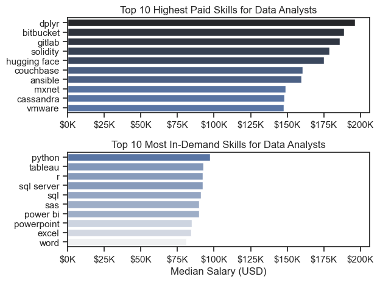
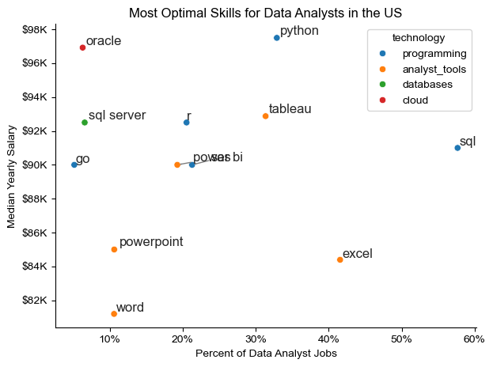

# Overview
Welcome to my analysis of the data job market, focusing on data analyst rose. This project was created out of a desire to navigate and understand the job market more effectively. It delves into the top paying and in demand skills to help find optimal job opportunities for data analysts.

The data source from Luke Barousse's Python course (https://www.youtube.com/watch?v=wUSDVGivd-8&t=39058s) which provides a foundation for my analysis, containing detailed information on job titles, salaries, location, and essential skills. Through a series of Python scripts I explore key questions such as the most demanded skills, salary trends, and the intersection of demand and salary in data analytics.

# The Questions
- Below are thequestions I want to answer in muy project

1. What are the skills most in demand for the top three most popular data roles?

2. How are in demand skills trending for data analysts?

3. How well do jobs and skills pay for data analysts?

4. What are the optimal skills for data analysts to learn?


# Tools I used 

- For my deep dive into the data anlyst job market, I harnessed the power of several key tools:

- Pandas Library: This was used to analyze the data.

- Matplotlib and Seaborn: These libraries were used to create visualizations of the data.

- Jupyter Notebooks: The tool I used to run my Python scriptrs which lwt me easily include my notes and anlysis.

-Visual Studio Code: My code editor 

- Git & Github: Essential for version control and sharing my Python code and Analysis, ensuring collaboration and reproducibilty.


# python_data_projects
This contains basic to advanced practice and a project based on job info from the YouTube video 'Python for Data Analytics - Full Course for Beginners' by Luke Barrrouse:
 'https://www.youtube.com/watch?v=wUSDVGivd-8&t=36353s'

Located in the folder Data_analytics_python


# The Analysis 

## 1. What are the most demanded skills for the top 3 most popular data roles?

To find the most demanded skills for the top 3 most popular roles, I filtered out those positions, and got the top 5 skills for these top three roles. This query highlights the most popluar job titles and their top skills, sjowing which skills I should pay attention to depending on which roles im tageting.

View my notebook with detailed steps here: [skills_count.ipynb](Data_Analytics_Python\Final_Data_project\skills_count.ipynb)


```python

fig, ax = plt.subplots(len(job_titles), 1)

sns.set_theme(style='ticks')

for i, job_title in enumerate(job_titles):
    df_plot = df_skills_perc[df_skills_perc['job_title_short'] == job_title].head(5)
    #df_plot.plot(kind='barh', x='job_skills', y='skill_percent', ax=ax[i], title=job_title)
    sns.barplot(data=df_plot, x='skill_percent', y='job_skills', ax=ax[i], hue='skill_count', palette='dark:b_r')
    # ax[i].invert_yaxis() -- Not needed in sns
    ax[i].set_title(job_title)
    ax[i].set_ylabel('')
    ax[i].set_xlabel('')
    ax[i].legend().remove()
    ax[i].set_xlim(0, 78)

    for n, v in enumerate(df_plot['skill_percent']):
        ax[i].text(v + 1, n, f'{v:.2f}%', va='center')

    if i != len(job_titles) - 1:
        ax[i].set_xticks([]) 

fig.suptitle("Likelihood of Skills Requested in Job Postings", fontsize=15)
fig.tight_layout(h_pad=0.5) # Fix the overlap
plt.show()
```

### Results


### Insights

- Python is a versatile skill, highly demanded across all three top data roles, but most prominantly for Data Scientists (72%) and Data Engineers (65%).

- SQL is also a highly demanded skill, and the most requested skill in the Data Analyst and Data Scientist, with it in over half of the job postings for bith roles. For Data Engiineers, Python is the most sought-after skill, appearing in 68% of job postings.

- Data Engineers require more specialized technical skills (AWS, Azure, Spark) compared to Data Analysts and Data Scientists who are expected to be proficient in more general management and analysis tools (Excel, Tableau).


## 2. How are in-demand skills trendind for Data Analysis?

```python

df_plot = df_DA_US_percent.iloc[:, :5]
sns.lineplot(data=df_plot, dashes=False, palette='tab10')
sns.set_theme(style='ticks')
sns.despine()

plt.title('Trending Top Skills For Data Analysts in The US')
plt.ylabel('Liklihood in Job Posting')
plt.xlabel('2023')
plt.legend().remove()

from matplotlib.ticker import PercentFormatter
ax = plt.gca()
ax.yaxis.set_major_formatter(PercentFormatter(decimals=0))

for i in range(5):
    plt.text(11.2, df_plot.iloc[-1,i], df_plot.columns[i])

plt.show()

```

### Results


*Bar graph visualizing the top trending skills for data analysts in the US in 2023.*

### Insights:

- SQL remains the most consistently demanded skill throughout the year, although it shows a gradual decrease in demand.

- Excel experienced a significant increase in demand starting around September, suropassing both Python and Tableau by the end of the year.

- Both Python and Tableau show relatively stable demand throughout the year with some fluctuations but remain essential skills for data analysts.
PowerBI, while less demanded compared to the others, shows a slight upward trend towards the years end.

## 3. How well do jobs and skills pay for data Analysis?

### Salary analysis for Data Nerds

#### Visualize Data

```python
sns.boxplot(data=df_US_top6, x='salary_year_avg', y='job_title_short', order=job_order)
sns.set_theme(style='ticks')

plt.title('Salary Distributions in The United States')
plt.xlabel('Yearly Salary (USD)')
plt.ylabel('')
plt.xlim(0, 600000)
ticks_x = plt.FuncFormatter(lambda y, pos: f'${int(y/1000)}K')
plt.gca().xaxis.set_major_formatter(ticks_x)
plt.show()
```

#### Results


#### Insights

- There is a significant variation in salary ranges across different job titles. Senior Data Scientist positions tend to have the highest salary potential, with up to 600K, indicating the high value placed on advanced data skills and experience in the industry.

- Senior Data Engineer and Senior Data Scientist roles show a considerable number of outliers on the higher end of the salary spectrum, suggesting that exceptional skills or circumstances can lead to high pay in these roles In contrast, Data analyst roles demonstrate more consistency in salary with fewer oultliers.

- The median salaries increase with the seniority and specialization of the roles. Senior roles (Senior Data Scientist, Senior Data Engineer) not only have higher median salaries but also larger differences in typical salaries, reflecting greater variance in compensation as responsibilities increase.


```python

fig, ax = plt.subplots(2, 1)  

sns.set_theme(style='ticks')

# Top 10 Highest Paid Skills for Data Analysts
sns.barplot(data=df_DA_top_pay, x='median', y=df_DA_top_pay.index, hue='median', ax=ax[0], palette='dark:b_r')
ax[0].legend().remove()
# original code:
# df_DA_top_pay[::-1].plot(kind='barh', y='median', ax=ax[0], legend=False) 
ax[0].set_title('Top 10 Highest Paid Skills for Data Analysts')
ax[0].set_ylabel('')
ax[0].set_xlabel('')
ax[0].xaxis.set_major_formatter(plt.FuncFormatter(lambda x, _: f'${int(x/1000)}K'))


# Top 10 Most In-Demand Skills for Data Analystsr')
sns.barplot(data=df_DA_skills, x='median', y=df_DA_skills.index, hue='median', ax=ax[1], palette='light:b')
ax[1].legend().remove()
# original code:
# df_DA_skills[::-1].plot(kind='barh', y='median', ax=ax[1], legend=False)
ax[1].set_title('Top 10 Most In-Demand Skills for Data Analysts')
ax[1].set_ylabel('')
ax[1].set_xlabel('Median Salary (USD)')
ax[1].set_xlim(ax[0].get_xlim())  # Set the same x-axis limits as the first plot
ax[1].xaxis.set_major_formatter(plt.FuncFormatter(lambda x, _: f'${int(x/1000)}K'))

plt.tight_layout()
plt.show()
```



# The analysis
## 3. How well do jobs and skills pay for Data Analysts
### Highest paid & Most Demanded Skills 
#### Insights:

- The top graph shows specialized technical skills like 'dplyr', 'Bitbucket', and 'Gitlab' are associaated with higher salaries, some reaching up to $200k, suggesting that advanced technical proficiency can increase earning potential.

- The bottom graph highlights that foundational skills like 'Excel', 'Powerpoint', and 'SQL' are the most in demand, even though they may not offer the highest salaries. This demonstrates the importance of these core skills for employability in data analysis roles.

- There's a clear distinction between the skills that are highest paid and those that are most in demand. Data analysts aiming to maximize their career potential should consider developing A diverse skill set that includes both high paying specialized skills and widely demanded foundational skills.


# The analysis
## What is the most optimal skill to learn for data analysis

### Visualize Data

```python
sns.scatterplot(
    data=df_plot,
    x="skill_percent",
    y="median_salary",
    hue='technology'
)

sns.despine()
sns.set_theme(style='ticks')

# Prepare texts for adjustText
texts = []
for i, txt in enumerate(df_DA_skills_high_demand.index):
    texts.append(plt.text(df_DA_skills_high_demand['skill_percent'].iloc[i], df_DA_skills_high_demand['median_salary'].iloc[i], txt))

# Adjust text to avoid overlap
adjust_text(texts, arrowprops=dict(arrowstyle='->', color='gray'))

# Set axis labels, title, and legend
plt.xlabel('Percent of Data Analyst Jobs')
plt.ylabel('Median Yearly Salary')
plt.title('Most Optimal Skills for Data Analysts in the US')

from matplotlib.ticker import PercentFormatter

ax = plt.gca()
ax.yaxis.set_major_formatter(plt.FuncFormatter(lambda y , pos: f'${int(y/1000)}K'))
ax.xaxis.set_major_formatter(PercentFormatter(decimals=0))


# Adjust layout and display plot 
plt.tight_layout()
plt.show()
```



#### Insights

- The scatterplot shows that most of the programming skills, colored blue, tend to cluster at high salary levels compared to other categories, indicating that programming expertise final food greater salary benefits within the data analytics field.

- analyst tools, color green, including tableau and power BI, are prevalent in job postings and offer competitive salaries, showing that visualization and data analysis software are crucial for data roles. This category not only has good salaries but is also versatile across different types of data tasks.

- the database skills, colored orange, such as Oracle and sql server, or associated with some of the higher salaries among data analyst tools. This indicates a significant demand and valuation for data management and manipulation expertise in the industry.


# What I Learned
- throughout this project, I deepen my understanding of the data analyst job market and enhance my technical skills in Python, especially in data manipulation and visualization. Here are a few things I learned specifically:

-Advanced Python Usage: utilizing libraries such as Pandas for data manipulation, Seaborn and Matplotlib for data visualization, and other libraries help me perform complex data analysis tests more efficiently.

- Data Cleaning Importance: I learned that through data cleaning and preparation are crucial before any analysis can be conducted, ensuring the accuracy of insights derived from the data.

- Stratgetic Skill Analysis: the project emphasize the importance of aligning one skills with market demand. Understanding the relationship between skill demand, salary, and job availability allows for more strategic career planning in the tech industry.


# Insights
- this project provided several general insights into the job market for analysts: 

-Skill Demand and Salary Correlation: there is a clear correlation between the demand for specific skills and salaries these skills command. Advanced and specialized skills like Python And word will often lead to higher salaries.

-Market Trends: there are changing trends in skill demand, highlighting the dynamic nature of the data job market. Keeping up with these trends is essential for career growth in data analytics.

-Economic Value of Skills: understanding which skills are both in demand and well compensated can guide data analysts in prioritizing learning to maximize their economic returns.
